# Diagrama AS-IS — Atendimento ao Seguro-Desemprego pela URA da Caixa

Visualiza as **relações entre etapas e atores** da Parte C: a espinha da jornada do cidadão (etapas `1.1`→`6`), as três camadas de Shostack (Frontstage / Backstage / Suporte), os handoffs entre atores `[A]`–`[R]`, os 14 fail points (♦) cravados na causa, e as 3 articulações de risco (⛓) onde a ação cruza uma linha divisória.

**Convenções de aresta:** `──▶` fluxo do cidadão / handoff ativo · `┈┈▶` consulta/dependência de bastidor · `⚠` aponta para fail point · `⛓` cruzamento de linha divisória (ponto frágil).

```mermaid
flowchart LR
  %% ===================== ÓTICA DO CIDADÃO (ETAPAS) =====================
  Cidadao(["👤 Cidadão<br/>(demitido s/ justa causa)"])

  subgraph CID["Ótica do Cidadão — etapas da jornada"]
    direction LR
    E11["1.1 Pré-chamada<br/>(rescisão)"]
    E12["1.2 Liga<br/>(disca 0800)"]
    E2a["2a Recepção URA<br/>(saudação)"]
    E2b["2b Autenticação<br/>(CPF+NIS / KBA)"]
    E3["3 Navega URA<br/>(menu de voz)"]
    E4["4 Autoatendimento<br/>(status do benefício)"]
    E5["5 Fila + Atendimento<br/>(transbordo humano)"]
    E6["6 Desfecho<br/>(protocolo / encaminhamento)"]
  end

  Cidadao -->|"recebe TRCT"| E11
  E11 -->|"disca 0800 726 0207"| E12
  E12 -->|"conexão"| E2a
  E2a -->|"ouve saudação"| E2b
  E2b -->|"intenção: 'seguro-desemprego'"| E3
  E3 -->|"seleção"| E4
  E4 -->|"caso simples"| E6
  E4 -->|"caso complexo / pede humano"| E5
  E5 -->|"orientação final"| E6

  %% ===================== FRONTSTAGE (VISÍVEL) =====================
  subgraph FRONT["🤖 Frontstage (visível ao cidadão)"]
    direction TB
    O["[O] URA / IVR<br/>(onstage technology)"]
    Q["[Q] Atendente N1<br/>(humano)"]
  end

  %% ===================== BACKSTAGE (INVISÍVEL) =====================
  subgraph BACK["⚙️ Backstage (invisível, síncrono ao encontro)"]
    direction TB
    L["[L] TI Caixa<br/>Gateway APIs + gravação"]
    G["[G] Segurança<br/>regras KBA / antifraude"]
    P["[P] ASR / NLP"]
    J["[J] ACD / CTI<br/>roteador"]
    CRM[("CRM / Retaguarda")]
  end

  %% ===================== PROCESSOS DE SUPORTE =====================
  subgraph SUP["🏛️ Processos de Suporte (estrutural / assíncrono)"]
    direction TB
    A["[A] Empregador<br/>eSocial S-2299"]
    D["[D] Dataprev<br/>lote noturno"]
    C["[C] MTE<br/>status / carta"]
    B["[B] CODEFAT<br/>regras e scripts"]
    F["[F] Caixa<br/>TTS / pagamento"]
    K["[K] Telecom<br/>enlaces SIP 24/7"]
    M["[M] Supervisor<br/>metas TMA"]
    H["[H] Gov.br<br/>login federado"]
    N["[N] Cidadão Defeso"]
    I["[I] TCU / CGU<br/>auditoria FAT"]
    R["[R] SINE"]
  end

  %% ===================== HANDOFFS / DEPENDÊNCIAS =====================
  %% Frontstage liga às etapas
  E2a -.-> O
  E3 -.-> O
  E4 -.-> O
  E5 -.->|"⛓② handoff URA→humano"| Q

  %% Backstage da autenticação
  O -.->|"valida CPF/NIS"| L
  E2b -.->|"⛓① cruza visibilidade"| G
  G -.-> L

  %% Navegação / NLP
  O -.->|"áudio"| P
  B -->|"publica scripts/regras"| O

  %% Autoatendimento consome status
  O -.->|"consome status"| C
  F -.->|"converte em voz (TTS)"| O
  N -.->|"janela de defeso"| C

  %% Cadeia cega de dados (⛓③ vertical: Suporte → fala da URA)
  A ==>|"⛓③ registra S-2299"| D
  D ==>|"⛓③ processa lote"| C
  C ==>|"⛓③ alimenta status"| O
  H -.->|"falha biométrica força URA"| E11

  %% Fila e atendimento
  E5 -.->|"ACD enfileira por skill"| J
  K -.-> J
  J -->|"roteia"| Q
  Q -.->|"screen pop"| CRM
  M -.->|"monitora TMA/TME"| J
  Q -->|"escalation"| M

  %% Desfecho
  Q -->|"tipifica / protocolo"| E6
  E6 -.->|"encaminha"| R
  C -.->|"carta de concessão/indeferimento"| E6
  F -.->|"crédito Caixa Tem"| E6
  I -.->|"audita"| C

  %% ===================== FAIL POINTS =====================
  FP1[/"⚠ FP1 · S-2299 atrasada → 'não localizado'"/]
  FP8[/"⚠ FP8 · beco sem saída Gov.br"/]
  FP9[/"⚠ FP9 · BD legado fora do ar"/]
  FP3[/"⚠ FP3 + FP12 · KBA rígido → lockout"/]
  FP4[/"⚠ FP4 · menu confuso/profundo"/]
  FP5[/"⚠ FP5 · ASR não entende sotaque/ruído"/]
  FP11[/"⚠ FP11 · lag de governança (script velho)"/]
  FP2[/"⚠ FP2 + FP13 · status desatualizado / cadastro divergente"/]
  FP6[/"⚠ FP6 · queda no transbordo"/]
  FP7[/"⚠ FP7 + FP14 · desliga por TMA / sem instrução DPU"/]
  FP10[/"⚠ FP10 · defeso fora da janela"/]

  A -.->|"⚠"| FP1
  H -.->|"⚠"| FP8
  L -.->|"⚠"| FP9
  G -.->|"⚠"| FP3
  O -.->|"⚠"| FP4
  P -.->|"⚠"| FP5
  B -.->|"⚠"| FP11
  C -.->|"⚠"| FP2
  J -.->|"⚠"| FP6
  Q -.->|"⚠"| FP7
  N -.->|"⚠"| FP10

  %% ===================== ESTILOS =====================
  classDef etapa fill:#eaf2ff,stroke:#36b,stroke-width:1px,color:#123;
  classDef front fill:#e8f7ee,stroke:#2a8,color:#063;
  classDef back fill:#fff3e0,stroke:#e90,color:#630;
  classDef sup fill:#f3eaff,stroke:#85c,color:#319;
  classDef fail fill:#ffe3e3,stroke:#c00,stroke-width:1.5px,color:#900;

  class E11,E12,E2a,E2b,E3,E4,E5,E6 etapa;
  class O,Q front;
  class L,G,P,J,CRM back;
  class A,D,C,B,F,K,M,H,N,I,R sup;
  class FP1,FP8,FP9,FP3,FP4,FP5,FP11,FP2,FP6,FP7,FP10 fail;
```

---

## As 3 Articulações de Risco (⛓) — onde a ação cruza uma linha

| ⛓ | Aresta no diagrama | Linha cruzada | Fail points |
|---|---|---|---|
| **①** | `E2b ┈┈▶ [G]` | Visibilidade | ♦3, ♦12 — decisão de barrar nasce de regras KBA ocultas |
| **②** | `E5 ┈┈▶ [Q]` | Interação Interna + Visibilidade | ♦6, ♦7 — handoff URA→humano frágil (CTI × metas TMA) |
| **③** | `[A] ══▶ [D] ══▶ [C] ══▶ [O]` | as 3 linhas (vertical) | ♦1, ♦2 — "Cadeia Cega de Dados": URA não corrige erro upstream em tempo real |

> As arestas `══▶` (grossas) marcam a cadeia-cega vertical; as arestas rotuladas `⛓①`/`⛓②` marcam os cruzamentos horizontais de linha.

---

## Resumo dos handoffs (rastreabilidade etapa ↔ ator)

| Etapa | Ator(es) acionado(s) | Relação | Fail point |
|---|---|---|---|
| 1.1 | `[A]`→`[D]`→`[C]`, `[H]` | registro S-2299 alimenta status; Gov.br pode forçar URA | ♦1, ♦8 |
| 1.2 | `[K]` | enlaces de telecom completam a chamada | — |
| 2a | `[O]`, `[L]` | URA inicia sessão; TI grava p/ compliance | ♦9 |
| 2b | `[O]`→`[G]`→`[L]` | URA aciona regras KBA via gateway (⛓①) | ♦3, ♦12 |
| 3 | `[O]`, `[P]`, `[B]` | ASR/NLP classifica intenção; scripts do CODEFAT | ♦4, ♦5, ♦11 |
| 4 | `[O]`↔`[C]`, `[F]`, `[N]` | URA consome status do MTE e converte em voz | ♦2, ♦13, ♦10 |
| 5 | `[J]`→`[Q]`, `[M]`, `[K]` | ACD enfileira e roteia ao atendente; supervisor monitora (⛓②) | ♦6 |
| 6 | `[Q]`, `[R]`, `[C]`, `[F]`, `[I]` | atendente tipifica; encaminha ao SINE; carta/crédito; auditoria | ♦7, ♦14 |

*Nota:* a letra **E** não é atribuída a nenhum ator no artefato (lacuna herdada da Parte C). Diagrama derivado da matriz canônica `C_blueprint_asis.md` e das decisões em `C_grill_transcript.md`.
